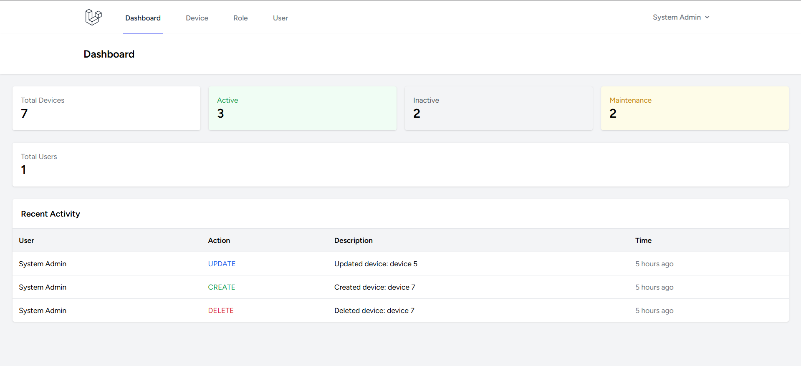
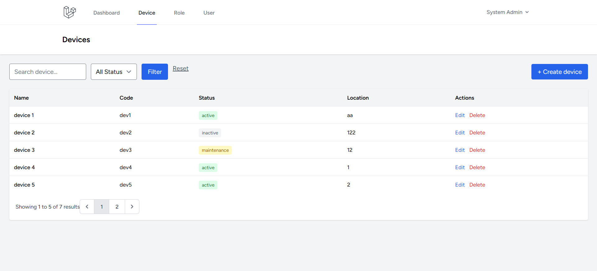
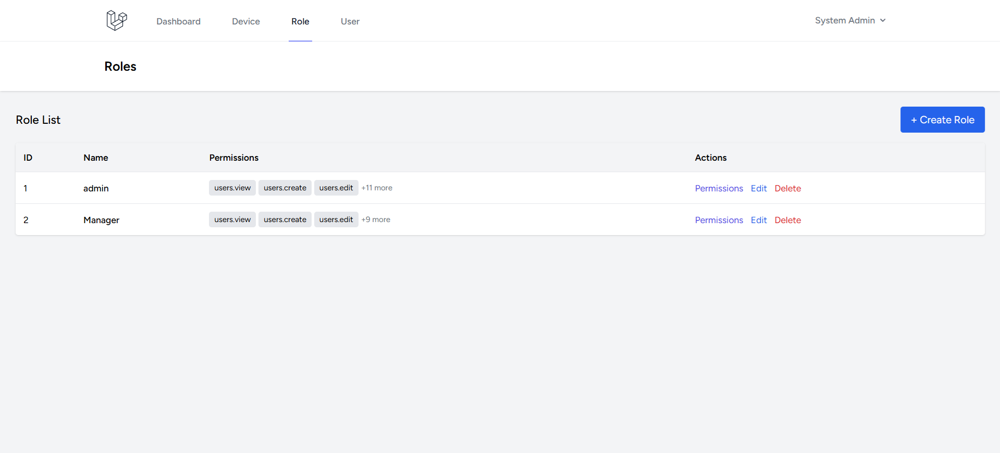

🚀 Device Management System

A role-based device management system built with Laravel, featuring authentication, permission control, activity
logging, and a clean admin dashboard.

📸 Preview





## ✨ Key Features

- 🔐 Authentication system (Laravel Breeze)
- 🛡 Role & Permission (RBAC - using Spatie)
- 👥 User Management (multi-role support)
- 📦 Device Management (CRUD + filter + pagination)
- 📝 Activity Logging (track user actions)
- 📊 Dashboard (real-time statistics + recent logs)
  🧠 System Design

### Role-Based Access Control (RBAC)

User → Role → Permissions

- Users can have multiple roles
- Roles contain multiple permissions
- Permissions control access to specific actions

Tracks:
✔ Create
✔ Update
✔ Delete

Each log contains:

- User
- Action
- Model
- Description
- Timestamp

### 🛠 Tech Stack

- Backend: PHP - Laravel
- Frontend: Blade + TailwindCSS
- Database: MySQL
- Auth: Laravel Breeze
- Permission: Spatie Laravel Permission
- Build tool: Vite

## ⚙️ Installation

### 1. Clone repo

```bash
git clone https://github.com/minhnc912/device-management
cd device-management
```

### 2. Install dependencies

```bash
composer install
npm install
```

### 3. Setup environment

```bash
cp .env.example .env
php artisan key:generate
```

### 4. Configure database

```bash
DB_DATABASE=your_db
DB_USERNAME=root
DB_PASSWORD=your_password
```

### 5. Run migration & seed

```bash
php artisan migrate --seed
```

### 6. Build assets

```bash
npm run build
```

or run dev:

```bash
npm run dev
```

### 7. Run server

```bash
php artisan serve
```

## 🔐 Demo Account

Email: admin@gmail.com
Password: 12345678

## 👨‍💻 Author

Name: Nguyễn Công Minh
GitHub: https://github.com/minhnc912
